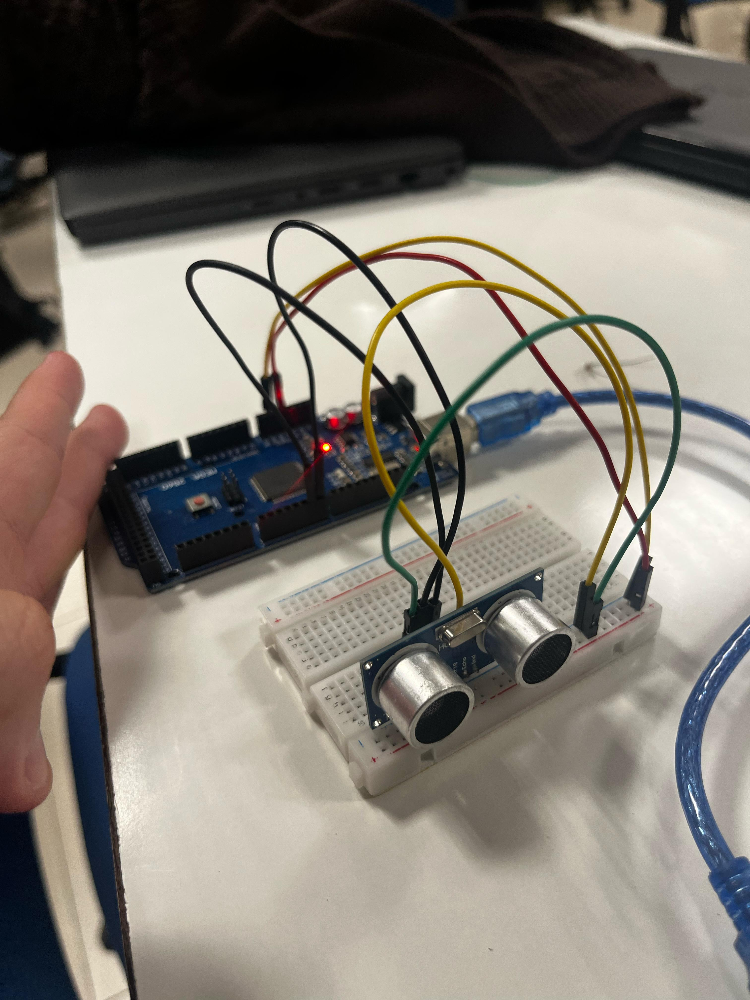
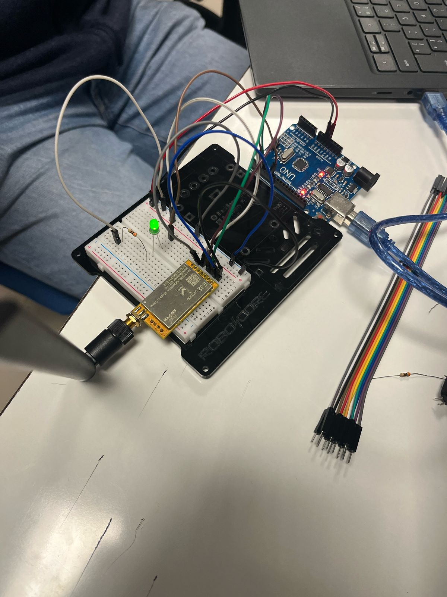
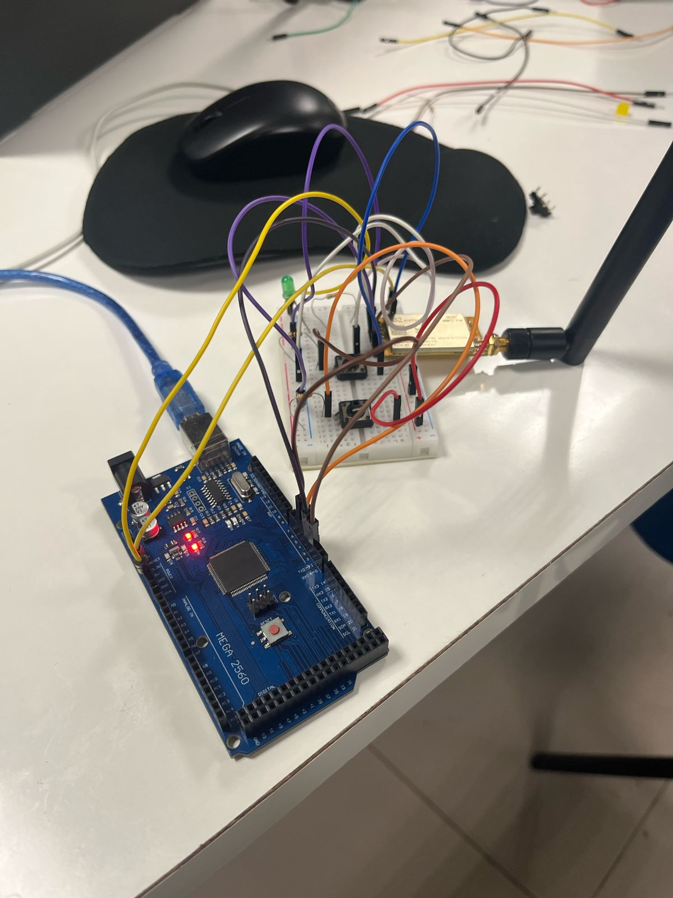

# Projeto de Sistema Embarcado - Comunicação LORA (CANSAT 2025)

## Links
[Overleaf](https://www.overleaf.com/project/67d9fed686f30143346a00f5)

## Descrição do Projeto
Este projeto consiste na implementação de um sistema de comunicação sem fio utilizando a tecnologia LORA (Long Range), desenvolvido para a disciplina de Projeto de Sistema Embarcado. O objetivo principal é estabelecer uma comunicação eficiente entre um transmissor e um receptor, possibilitando a troca de dados a longa distância com baixo consumo de energia.

## Tecnologias Utilizadas
- Arduino
- Módulos LORA OSOYOO UART
- ESP32
- Mosquitto MQTT Broker
- Sensor Ultrassônico HC-SR04
- Software Arduino IDE
- Impressão 3D para o case dos dispositivos

## Implementação

### Comunicação LORA
Em nossa implementação, utilizamos módulos LORA OSOYOO UART para estabelecer a comunicação sem fio. Após alguns testes iniciais e ajustes, conseguimos com sucesso realizar a transmissão de dados entre o receptor e o transmissor na aula do dia 27/03/2025.

#### Código de Comunicação
O código abaixo foi implementado para estabelecer a comunicação entre os dispositivos:

```cpp
#include <SoftwareSerial.h>

SoftwareSerial mySerial(2, 3); //TX, RX
// (Send and Receive)

void setup() {
  Serial.begin(9600);
  mySerial.begin(9600);
}

void loop() {

  if(Serial.available() > 0){//Read from serial monitor and send over OSOYOO UART LoRa wireless module
    String input = Serial.readString();
    mySerial.println(input);
  }

  if(mySerial.available() > 1){//Read from OSOYOO UART LoRa wireless module and send to serial monitor
    String input = mySerial.readString();
    Serial.println(input);
  }
  delay(20);
}
```

Este código utiliza a biblioteca SoftwareSerial para criar uma porta serial virtual, permitindo a comunicação entre o Arduino e o módulo LORA. O programa monitora constantemente duas entradas:
1. Dados recebidos pela porta serial do computador, que são enviados para o módulo LORA
2. Dados recebidos pelo módulo LORA, que são enviados para a porta serial do computador

### Implementação do MQTT com ESP32
Em nossos testes realizados em 02/04/2025, implementamos o protocolo MQTT utilizando o ESP32 como dispositivo base. O MQTT (Message Queuing Telemetry Transport) será utilizado em conjunto com a tecnologia LORA para fornecer uma comunicação robusta e eficiente para nosso projeto CANSAT.

#### Etapas de Testes com MQTT

1. **Teste com ESP32 e Sensor Ultrassônico**
   
   Inicialmente realizamos a integração do sensor ultrassônico HC-SR04 com o ESP32 para validar a leitura de dados do sensor. Este teste foi fundamental para garantir que os dados coletados estivessem corretos antes de implementar a comunicação MQTT.

   
   *ESP32 conectado ao sensor ultrassônico HC-SR04*

   [Código do teste com sensor ultrassônico](/scripts/esp32_ultrasonic.ino)

2. **Teste MQTT Local**
   
   Após validar o funcionamento do sensor, configuramos um broker MQTT local para testar a comunicação. Utilizamos o Mosquitto como broker MQTT e verificamos a transmissão e recebimento de mensagens entre o ESP32 e o computador local.

   
   *Terminal mostrando mensagens sendo transmitidas via MQTT localmente*
   
   [Código do teste MQTT local](/scripts/mqtt_local_test.ino)

3. **Teste MQTT com Broker Público**
   
   Em seguida, realizamos testes de conectividade com o broker público test.mosquitto.org. Durante esta etapa, encontramos um obstáculo: a rede Wi-Fi do IBMEC (onde os testes foram realizados) provavelmente bloqueia as conexões MQTT. Para contornar esse problema, conectamos o ESP32 à rede de dados móveis de um celular, obtendo sucesso na comunicação.

   
   *ESP32 conectado ao broker público test.mosquitto.org via rede de dados móveis*
   
   <video width="640" height="360" controls>
     <source src="videos/mqtt_public_test.mp4" type="video/mp4">
     Seu navegador não suporta o elemento de vídeo.
   </video>
   
   [Código do teste com broker público](/scripts/mqtt_public_broker.ino)

4. **Integração Completa: Sensor Ultrassônico + ESP32 + MQTT**
   
   Por fim, integramos todos os componentes: o sensor ultrassônico coletando dados, o ESP32 processando e enviando essas informações via MQTT para o broker. Esta integração completa demonstra o conceito base que será utilizado em nosso projeto CANSAT com tecnologia LORA.

   
   *Sistema completo em funcionamento: Sensor Ultrassônico + ESP32 + MQTT*
   
   <video width="640" height="360" controls>
     <source src="videos/full_integration_demo.mp4" type="video/mp4">
     Seu navegador não suporta o elemento de vídeo.
   </video>
   
   [Código da integração completa](/scripts/ultrasonic_mqtt_integration.ino)

### Materiais para Impressão 3D
Após pesquisa e análise, selecionamos o material PLA.

## Fotos e Vídeos do Projeto

### Testes de Comunicação (27/03/2025)

#### Receptor LORA

*Receptor LORA em funcionamento durante os testes*

#### Transmissor LORA

*Transmissor LORA em funcionamento durante os testes*

### Vídeo de Demonstração
<video width="640" height="360" controls>
  <source src="caminho/para/video_demonstracao.mp4" type="video/mp4">
  Seu navegador não suporta o elemento de vídeo.
</video>
*Demonstração do sistema em funcionamento com transmissão de dados em tempo real*

### Material para Impressão 3D


[Link do .stl](https://www.thingiverse.com/thing:6189990)

*Material selecionado para impressão do case dos dispositivos*

## Progresso do Projeto

| Data | Atividade | Status |
|------|-----------|--------|
| 27/03/2025 | Testes de comunicação LORA | ✅ Concluído |
| 27/03/2025 | Seleção de material para impressão 3D | ✅ Concluído |
| 27/03/2025 | Documentação fotográfica e em vídeo | ✅ Concluído |
| 02/04/2025 | Testes com Mosquitto MQTT e ESP32 | ✅ Concluído |
| Próxima aula | Início da impressão 3D do case | 🔄 Pendente |
| Próxima aula | Integração MQTT com LORA | 🔄 Pendente |

## Equipe
- André C. Coelho
- Marceu V. A. Filho
- Michel L. D'orsi
- Rigel P. Fernandes
